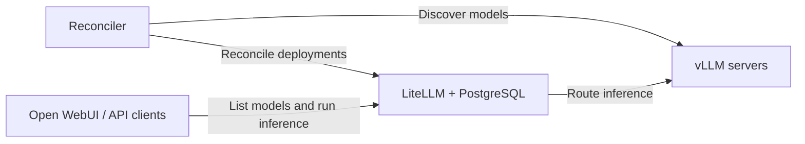

# vLLM–LiteLLM Model Reconciler

[](https://github.com/taki-d/litellm-vllm-reconsiler/actions/workflows/ci.yml)

Keep LiteLLM's model catalog in sync with the models served by your vLLM servers.

This Rust service discovers models through each server's `/v1/models` endpoint
and reconciles them with LiteLLM's database-backed deployments. Clients such as
Open WebUI connect to LiteLLM, while the reconciler manages model registration
without restarting the proxy.

## How it works



- Preserve vLLM model IDs as public LiteLLM model names.
- Register multiple servers under the same model name for LiteLLM load balancing.
- Add and verify replacement deployments before retiring old ones.
- Apply failure thresholds and deletion grace periods to avoid premature removal.
- Preserve static models and deployments owned by other tools or users.
- Provide dry-run mode, JSON logs, health endpoints, and Prometheus metrics.

Run **one reconciler instance** per managed catalog. Deployment state lives in
LiteLLM; the reconciler does not maintain its own database.

## Quick start

### Docker Compose

Prerequisites: Docker with Compose and reachable vLLM servers. The supplied
Compose stack starts PostgreSQL, LiteLLM, and the reconciler; vLLM servers are
configured separately.

1. Copy the configuration templates:

   ```sh
   cp .env.example .env
   cp examples/reconciler.yaml config.yaml
   ```

2. Set the credentials in `.env`, update the vLLM URLs in `config.yaml`, and
   replace or remove the fixed internal API example in `examples/litellm.yaml`.
   The vLLM URLs must be reachable from the containers. For a server running on
   the Docker Desktop host, use `host.docker.internal`.

3. Start the stack and inspect the logs:

   ```sh
   docker compose up -d --build
   docker compose logs -f reconciler
   ```

LiteLLM is exposed at `http://127.0.0.1:4000`; reconciler health and metrics are
available at `http://127.0.0.1:9090`. Both published ports bind to localhost.

Use an alphanumeric PostgreSQL password with this Compose example because it is
embedded in the database connection URL. Keep `.env` and `config.yaml` local;
both are excluded from Git.

### Run from source

Prerequisites: Rust 1.85 or later, an existing LiteLLM instance with database
model storage enabled, and reachable vLLM servers.

```sh
cp examples/reconciler.yaml config.yaml
# Update all URLs in config.yaml for the machine running this command.
export LITELLM_MASTER_KEY='sk-replace-with-your-master-key'
export VLLM_1_API_KEY='replace-with-your-vllm-1-key'
export VLLM_2_API_KEY='replace-with-your-vllm-2-key'

# Preview changes without writing to LiteLLM.
cargo run --locked -- --config config.yaml --once --dry-run

# Start the reconciliation loop.
cargo run --locked --release -- --config config.yaml
```

Set the same vLLM API key environment variables on **LiteLLM as well as the
reconciler**. Registered deployments reference those variables by name.

## Command-line options

```text
vllm-reconciler [--config config.yaml] [--once] [--dry-run]
```

| Option | Behavior |
| --- | --- |
| `--config PATH` | Read configuration from `PATH`; defaults to `config.yaml`. |
| `--once` | Run one cycle and exit; return exit code 1 on failure. |
| `--dry-run` | Discover models and log planned changes without modifying LiteLLM. |
| `--help`, `-h` | Print usage information. |

Configuration is read at startup. Restart the reconciler after changing its
server configuration. Model changes on an existing vLLM server are discovered
automatically.

## Documentation

| Guide | Contents |
| --- | --- |
| [Configuration](docs/configuration.md) | Settings, defaults, authentication, and secret files. |
| [Operations](docs/operations.md) | Ownership, reconciliation, LiteLLM compatibility, monitoring, and Open WebUI. |
| [Testing](docs/testing.md) | Local checks, GitHub Actions, Docker E2E tests, and deployment validation. |

## Development

```sh
cargo fmt --check
cargo clippy --locked --all-targets -- -D warnings
cargo test --locked
python3 -B -m unittest discover -s tests/e2e -p 'test_*.py'
```

GitHub Actions also runs an E2E test against real LiteLLM and PostgreSQL with a
mock vLLM server. No GPU, external inference API, or GitHub secrets are required.
See the [testing guide](docs/testing.md) for the scope and local run instructions.

## Repository layout

| Path | Purpose |
| --- | --- |
| `src/` | Reconciliation loop, API clients, configuration, CLI, and telemetry. |
| `examples/` | Reconciler and LiteLLM configuration templates. |
| `tests/reconcile.rs` | Rust integration tests using HTTP mocks. |
| `tests/e2e/` | Docker E2E stack, mock vLLM server, and verification scripts. |
| `docs/` | Configuration, operations, and testing guides. |
| `.github/workflows/ci.yml` | Automated checks and model registration E2E job. |
